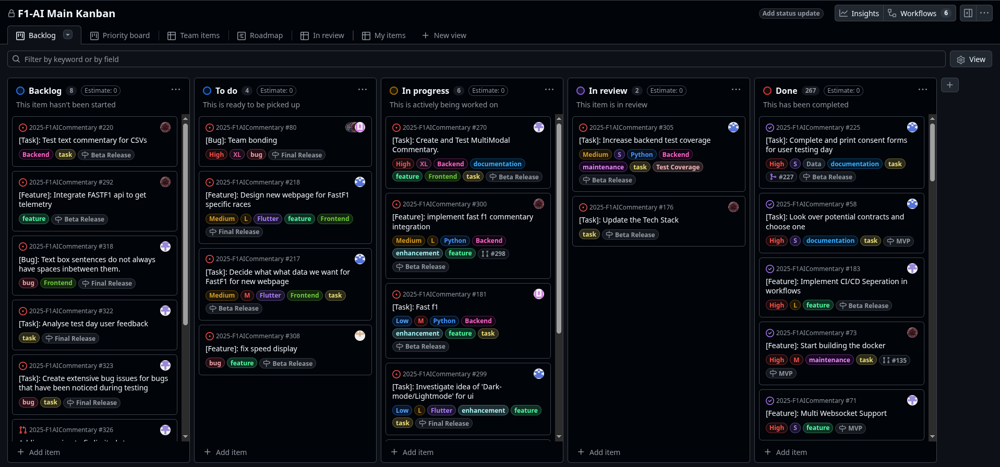

# Kanban Board

Our team uses a Kanban board to manage our progress, tracking tasks across different stages of development such as **To Do**, **In Progress**, **In Review**, and **Done**. This allows us to maintain a clear overview of our sprint backlog and upcoming features.

You can view our live project tracking here:
**[View our Kanban Board on GitHub](https://github.com/orgs/spe-uob/projects/350)**

## Board Overview

